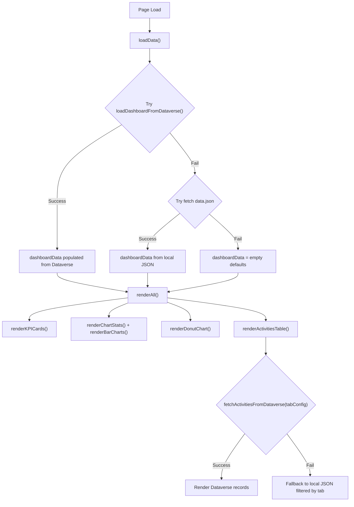

# Walkthrough: File Merge & Dataverse FetchXML Integration

## Summary of Changes

Consolidated the NextDesk dashboard from 3 files (`index.html`, `styles.css`, `script.js`) into a **single `index.html`** file ready for Power Apps web resource deployment, and integrated **Dataverse FetchXML** data fetching for the Activities table, KPI cards, and charts.

---

## Files Changed

| File | Action | Details |
|------|--------|---------|
| [index.html](file:///c:/Users/efuas/Work/Accede/next-desk/index.html) | **Modified (overwritten)** | All CSS and JS merged inline; Dataverse integration added |
| `styles.css` | **Deleted** | Contents moved to `<style>` block in index.html |
| `script.js` | **Deleted** | Contents moved to `<script>` block in index.html |
| [data.json](file:///c:/Users/efuas/Work/Accede/next-desk/data.json) | **Kept** | Used as fallback data source for local development |

---

## Architecture: Data Flow

---

## Key New Functions

### Dataverse Utilities

| Function | Purpose |
|----------|---------|
| `getApiBase()` | Returns Dynamics 365 Web API base URL; uses `Xrm` context in Power Apps, falls back to `window.location.origin` |
| `fetchWithXml(base, table, fetchXml)` | Reusable FetchXML query executor — matches colleague's pattern with `credentials: 'include'` for session auth |
| `getRecordValue(record, fieldName)` | Extracts display-friendly values from Dataverse records (handles option sets, lookups, dates via OData annotations) |
| `formatDateTime(isoString)` | Formats ISO dates to human-readable format as fallback when Dataverse annotations unavailable |

### Activity Data Fetching

| Function | Purpose |
|----------|---------|
| `fetchActivitiesFromDataverse(tableConfig)` | **Reusable per-tab fetcher** — takes any entry from `ACTIVITY_TABLE_REGISTRY`, builds FetchXML, returns normalised `{ id, activity, dateTime, status, user }` array |

### KPI & Chart Data Fetching

| Function | Purpose |
|----------|---------|
| `fetchKPICount(entitySetName, entityLogicalName, columnName)` | Total record count for any entity |
| `fetchKPIFilteredCount(entitySetName, entityLogicalName, columnName, filterXml)` | Filtered record count with FetchXML condition |
| `fetchStatusCount(tableConfig, statusValue)` | Convenience wrapper — counts records matching a specific status option-set value |
| `loadDashboardFromDataverse()` | Orchestrates 15 parallel status-count queries to populate all KPI cards, chart data, and CI Health donut in one go |

---

## Configuration Objects

### `ACTIVITY_TABLE_REGISTRY`

Maps each tab to its Dataverse table and column logical names:

| Tab | Entity Set Name | Key Columns |
|-----|----------------|-------------|
| Service Request | `cr229_requestses` | `cr229_requestname`, `cr229_requeststatus`, `cr229_by` |
| Incident | `cr229_incidents` | `cr229_incidentstatus`, `cr229_by` |
| CI | `cr229_itsm_assets` | `cr229_ciname`, `ma_cistatus`, `createdby` |
| Change | `cr229_changes` | `cr229_name`, `cr229_changestatus`, `cr229_by` |
| Problem | `cr229_problems` | `cr229_name`, `cr229_problemstatus`, `cr229_by` |
| Client Request | `ma_clientrequests` | `ma_email`, `ma_status`, `createdby` |

### `STATUS_VALUES`

Numeric option-set values for FetchXML filter conditions:

- **General** (SR, Incident, Problem, Change): Open=`497700000`, Pending=`497700001`, Close=`497700002`
- **CI**: Active=`124520000`, Maintenance=`124520001`, Retired=`124520002`

---

## UI Changes

- **"All" tab removed** from Recent Activities — each tab now fetches from its dedicated Dataverse table
- **"Service Requests" is the default active tab**
- **Status filter dropdown** updated with Dataverse status values (Open, Pending, Close, etc.)
- **New CSS classes** for Dataverse status badges: `.status-badge.open`, `.status-badge.close`, `.status-badge.active`, `.status-badge.maintenance`, `.status-badge.retired`
- **Race condition protection** via `currentFetchId` counter — prevents stale data from rendering when tabs are switched rapidly
- **Date filter** now uses `new Date()` (current time) instead of hardcoded reference date

---

## Verification

### Local Development
- Opening `index.html` locally will attempt Dataverse (which will fail due to auth), then fall back to `data.json` — dashboard renders identically to the original multi-file version.

### Power Apps Deployment
- Upload `index.html` as a web resource in Dynamics 365.
- Dataverse APIs will authenticate via session cookies automatically.
- KPI cards, charts, and activities table will populate from live Dataverse data.
- Console logs indicate data source: `"Dashboard data loaded from Dataverse."` or `"Dashboard data loaded from local data.json."`
